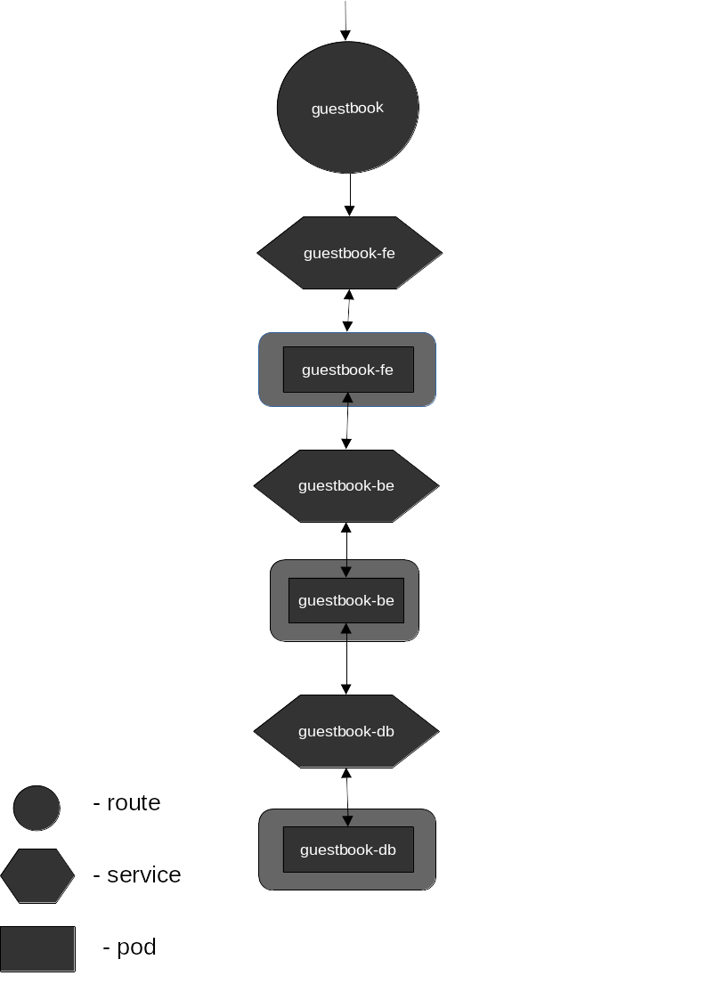

# Kubernetes mini project
This web-app was created for "Client-server architecture" class project
at the Polish Naval Academy during my bachelor studies.

Code quality and security of the app was not that important.
The goal was to create simple (yet usefull) app that can be deployed with k8s. 

Each module was containerized using Docker and run in RedHat OpenShift cluster.
All the yaml configuration files are located in [k8s-yml/](k8s-yml).

**Apps architecture:**

**Tech Stack:**
- frontend: react SPA
- backend:  python FastAPI REST API
- database: postgres