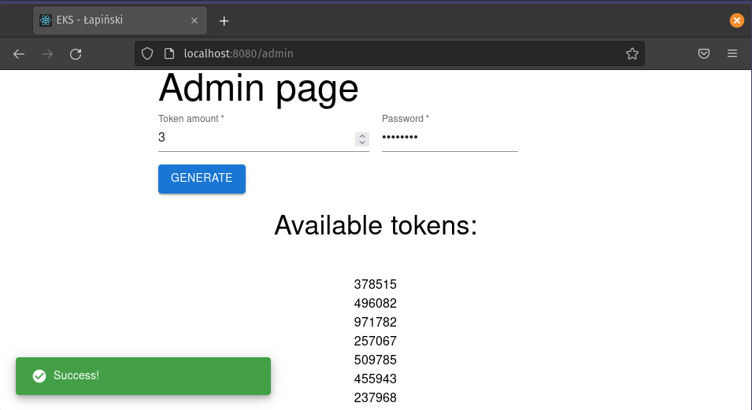

# Kubernetes mini project
This web-app was created for "Client-server architecture" class project
at the Polish Naval Academy during my bachelor studies.

## Functionality

The app is a wedding guest book. The idea was to create a web version of a classic guest book
that contains some nice words from the guests to the newlyweds.

- First admin has to generate tokens. Bride and groom would distribute them among guests, during the wedding.

    

- Guests would enter received token on the website along with a couple of words from the bottom of their hearts.

    

Code quality and security of the app was not that important.
The goal was to create simple (yet usefull) app that can be deployed with k8s. 

Each module was containerized using Docker and run in RedHat OpenShift cluster.
All the yaml configuration files are located in [k8s-yml/](k8s-yml).

### Apps architecture:

### Tech Stack:
- frontend: react SPA
- backend:  python FastAPI REST API
- database: postgres